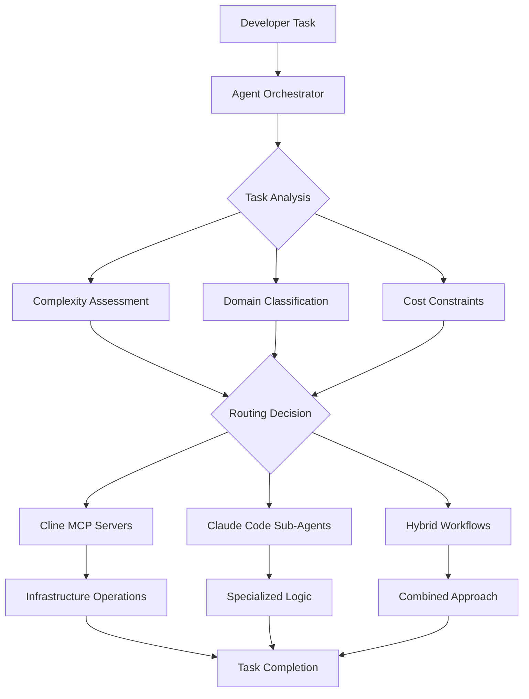

# AI Agent Orchestration System - AI-SDLC Framework

**Framework Version:** {{ extra.version.framework }} - {{ extra.version.name }}

## 🎭 Intelligent Agent Orchestration

The AI-SDLC framework includes a sophisticated **Agent Orchestration System** that intelligently routes development tasks between **Cline MCP servers** and **Claude Code sub-agents**, optimizing for cost, performance, and domain expertise.

---

## 🏗️ System Architecture

### **Three-Tier Agent Ecosystem**



### **Agent Categories**

| **Category**                | **Purpose**                 | **Cost** | **Performance** | **Use Cases**                 |
| --------------------------- | --------------------------- | -------- | --------------- | ----------------------------- |
| **MCP Servers (6)**         | Infrastructure & Operations | $0.01    | Fast            | File ops, DB, GitHub, testing |
| **Budget Sub-Agents (1)**   | Simple Tasks                | $0.05    | Fast            | Bug fixes, formatting         |
| **Standard Sub-Agents (2)** | Medium Complexity           | $0.10    | Balanced        | Docs, optimization            |
| **Premium Sub-Agents (4)**  | Domain Expertise            | $0.25    | Thorough        | FCRA, security, architecture  |

---

## 🧠 Intelligent Routing Logic

### **Task Complexity Assessment**

The orchestrator analyzes tasks across multiple dimensions:

#### **Complexity Scoring (1-5 Scale)**

```javascript
// File count impact
fileCount > 5: +2 points
fileCount > 2: +1 point

// Task type keywords
['architecture', 'security', 'compliance']: +1 each
['refactor', 'migrate', 'optimization']: +1 each

// Credit repair domain
['credit', 'fcra', 'dispute']: +1 point

// Context factors
requiresComplianceReview: +3 points
affectsMultipleServices: +2 points
hasSecurityImplications: +2 points
```

#### **Domain Classification**

- **credit_repair**: Credit scores, disputes, FCRA/FACTA compliance
- **testing**: Unit, integration, E2E test generation and execution
- **security**: PII protection, encryption, audit trails
- **documentation**: Technical writing, API docs, compliance guides
- **database**: PostgreSQL operations, schema design, optimization
- **performance**: Query optimization, caching, memory management

#### **Cost Constraint Analysis**

- **budget**: Tasks under $0.10 constraint
- **standard**: Tasks under $0.25 constraint
- **premium**: Complex tasks requiring specialized expertise

---

## 🎯 Agent Selection Examples

### **Simple Task Routing**

```bash
Task: "Fix typo in user registration form"

Analysis:
- Complexity: 1 (simple text change)
- Domain: general
- Cost constraint: budget

Selected Agent: budget-code-assistant
Cost: $0.05
Reasoning: Simple task, no domain expertise required
```

### **Medium Complexity Routing**

```bash
Task: "Optimize database queries for customer search"

Analysis:
- Complexity: 3 (performance optimization)
- Domain: database, performance
- Cost constraint: standard

Selected Agent: performance-optimizer + postgresql_enhanced MCP
Cost: $0.11 ($0.10 sub-agent + $0.01 MCP)
Reasoning: Database expertise with infrastructure support
```

### **Complex Domain Task Routing**

```bash
Task: "Design FCRA-compliant architecture for dispute resolution system"

Analysis:
- Complexity: 5 (architecture + compliance)
- Domain: credit_repair, security, architecture
- Cost constraint: premium

Selected Agent: architecture-planner-fcra + ai_sdlc_toolkit MCP
Cost: $0.26 ($0.25 sub-agent + $0.01 MCP)
Reasoning: Requires specialized FCRA expertise and system design
```

### **Hybrid Workflow Example**

```bash
Task: "Implement comprehensive PII auditing with automated testing"

Analysis:
- Complexity: 4 (multi-domain task)
- Domain: security, testing
- Cost constraint: premium

Selected Agents:
1. secure_filesystem MCP (PII scanning)
2. security-auditor-enhanced (audit logic)
3. credit-test-generator (automated testing)

Cost: $0.53 ($0.01 + $0.25 + $0.25 + $0.02 coordination)
Reasoning: Complex task requiring infrastructure + specialized expertise
```

---

## 📊 Performance Optimization Features

### **Historical Performance Tracking**

```javascript
// Success rate bonuses
success_rate > 90%: +10 score points
success_rate > 80%: +5 score points
success_rate < 60%: -5 score points (avoid agent)

// Usage pattern analysis
underutilized_agents: Review routing logic
overutilized_agents: Add load balancing
```

### **Cost Efficiency Optimization**

```javascript
// Budget alignment scoring
budget_task + budget_agent: 10 points (perfect match)
premium_task + budget_agent: 3 points (mismatch penalty)
simple_task + premium_agent: 5 points (cost inefficient)
```

### **Fallback Chain Management**

```javascript
// Automatic fallback chains
credit-compliance-reviewer → security-auditor-enhanced → budget-code-assistant
credit-test-generator → budget-code-assistant
architecture-planner-fcra → documentation-specialist
```

---

## 🔧 Configuration and Setup

### **Orchestrator Configuration**

**File**: `scripts-complex/agent-orchestrator.js`

Key configuration options:

```javascript
{
  "cost_optimization": {
    "enabled": true,
    "budget_thresholds": {
      "low": 0.05,    // Route to budget agents
      "medium": 0.15, // Route to standard agents
      "high": 0.50    // Allow premium agents
    },
    "fallback_strategy": "cascade_to_budget"
  },
  "performance_monitoring": {
    "success_rate_threshold": 0.85,
    "response_time_threshold": 30000,
    "retry_limit": 3
  }
}
```

### **MCP Server Integration**

The orchestrator automatically discovers MCP servers from `.mcp.json`:

```javascript
// Detected MCP servers
{
  "ai_sdlc_toolkit": "credit_repair, testing expertise",
  "secure_filesystem": "security, pii_protection expertise",
  "postgresql_enhanced": "database expertise",
  "github_integration": "devops, ci_cd expertise",
  "playwright_automation": "testing, e2e expertise",
  "web_content_fetch": "documentation expertise"
}
```

### **Sub-Agent Discovery**

Sub-agents loaded from `claude-code-sub-agents-config.json`:

```javascript
// Detected sub-agents
{
  "credit-compliance-reviewer": "premium, fcra_compliance",
  "credit-test-generator": "premium, credit_repair, e2e_automation",
  "security-auditor-enhanced": "premium, pii_protection",
  "documentation-specialist": "standard, technical_writing",
  "architecture-planner-fcra": "premium, compliance_architecture",
  "performance-optimizer": "standard, database_optimization",
  "budget-code-assistant": "budget, simple_tasks"
}
```

---

## 📈 Usage and Monitoring

### **Command Line Interface**

```bash
# Run orchestration analysis
npm run subagents:orchestrate

# Test routing logic with sample tasks
node scripts-complex/agent-orchestrator.js

# View orchestration metrics
node scripts-complex/agent-orchestrator.js --metrics

# Analyze cost efficiency
node scripts-complex/agent-orchestrator.js --cost-analysis
```

### **Integration with Development Workflow**

```bash
# Automatic orchestration (in development)
# When using Cline or Claude Code, the orchestrator:
# 1. Analyzes the task complexity and domain
# 2. Routes to optimal agent combination
# 3. Tracks performance and costs
# 4. Provides fallback options if needed
```

### **Monitoring Dashboard Output**

```json
{
  "total_orchestrated_requests": 156,
  "agent_distribution": {
    "mcp_servers": 89,
    "sub_agents": 52,
    "hybrid": 15
  },
  "cost_analysis": {
    "total_estimated_cost": "12.34",
    "average_cost_per_task": "0.079",
    "cost_trend": "stable"
  },
  "performance_trends": {
    "routing_accuracy": "95%",
    "avg_decision_time": "150ms",
    "fallback_usage_rate": "2%"
  }
}
```

---

## 🚨 Troubleshooting

### **Agent Not Available**

```bash
# Check MCP server status
npm run mcp:status

# Validate sub-agent configuration
npm run subagents:validate

# Test orchestrator
node scripts-complex/agent-orchestrator.js --test
```

### **Routing Logic Issues**

```bash
# Debug routing decisions
node scripts-complex/agent-orchestrator.js --debug

# Review agent capabilities mapping
node scripts-complex/agent-orchestrator.js --capabilities

# Analyze historical decisions
node scripts-complex/agent-orchestrator.js --history
```

### **Performance Problems**

```bash
# Check success rates by agent
node scripts-complex/agent-orchestrator.js --performance

# Review cost efficiency
node scripts-complex/agent-orchestrator.js --cost-efficiency

# Get optimization recommendations
node scripts-complex/agent-orchestrator.js --optimize
```

---

## 🔬 Advanced Features

### **Machine Learning Optimization**

The orchestrator learns from task outcomes:

- **Success rate tracking** for each agent type
- **Performance pattern recognition** for similar tasks
- **Cost optimization** based on actual results
- **Automatic routing adjustment** over time

### **Context-Aware Routing**

```javascript
// Context factors influence routing
{
  urgency: 'high' → prioritize fast agents
  quality_requirement: 'production' → prioritize thorough agents
  budget_constraint: 'strict' → prioritize budget agents
  compliance_required: true → prioritize specialized agents
}
```

### **Hybrid Workflow Patterns**

```javascript
// Common hybrid patterns
{
  "infrastructure_plus_logic": "MCP server + specialized sub-agent",
  "validation_pipeline": "Multiple agents in sequence",
  "parallel_analysis": "Multiple agents analyzing same task",
  "fallback_cascade": "Primary agent → backup → budget fallback"
}
```

---

## 📚 Related Documentation

- **[Claude Code Sub-Agents Setup](claude-code-sub-agents-setup.md)**: Sub-agent configuration
- **[MCP Server Setup Guide](mcp-server-setup.md)**: MCP server configuration
- **[Enhanced Cline Guidelines](enhanced-cursor-guidelines.md)**: Primary platform setup
- **[Cost Optimization Guide](enhanced-config-management.md)**: Budget management
- **[Scripts Reference](scripts-reference.md)**: Technical implementation details

---

**🎭 The Agent Orchestration System provides intelligent, cost-optimized routing between Cline MCP servers and Claude Code sub-agents, ensuring optimal performance for credit repair development workflows while maintaining budget efficiency.**
