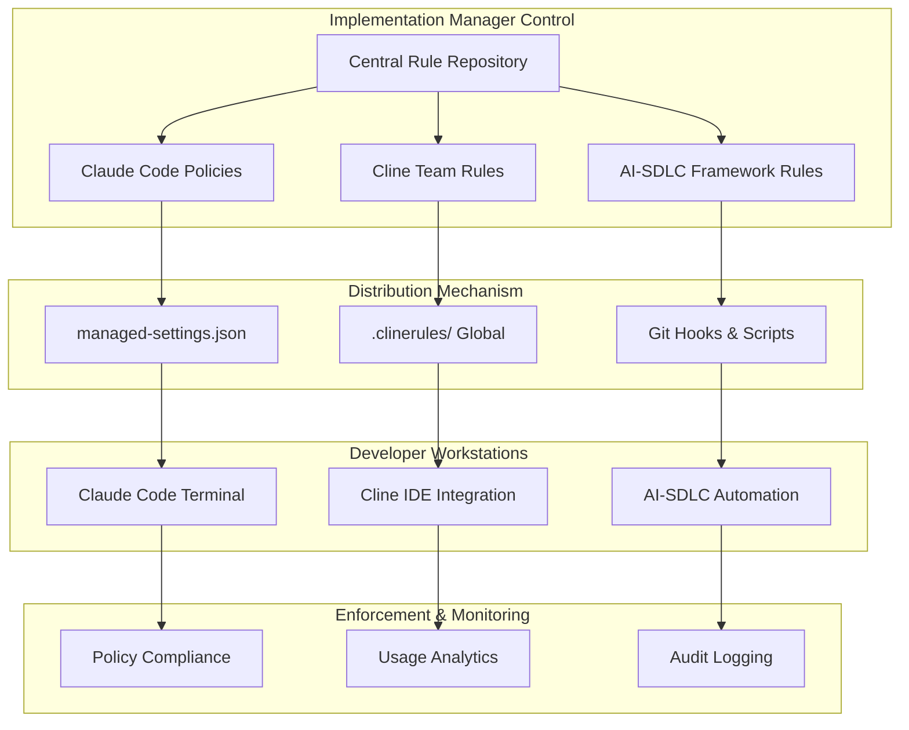

# Centralized Ruleset Management - AI-SDLC v2.8.1

## 🎯 **Implementation Manager Guide: Claude Code + Cline Enterprise Governance**

This guide provides complete instructions for implementation managers to centrally manage AI development rules, policies, and configurations across all TheCreditPros development teams.

---

## 📋 **Executive Summary for Implementation Managers**

**Central Management Requirements:**

- **Claude Code**: Enterprise policy enforcement via `managed-settings.json`
- **Cline**: Team rules distribution via global `.clinerules` directory
- **Consistency**: Unified development standards across all repositories
- **Compliance**: FCRA/FACTA regulatory requirements built into all configurations
- **Audit**: Complete traceability of AI-assisted development activities

**Business Impact:**

- **Standardization**: 100% consistent development practices across 8-person team
- **Compliance**: Automated FCRA/FACTA validation in all AI-generated code
- **Efficiency**: Zero configuration drift between team members
- **Cost Control**: Centralized usage monitoring and budget management

---

## 🏗️ **Architecture: Centralized Rule Distribution**



---

## 🔧 **Claude Code Enterprise Policy Management**

### **Step 1: Create Master Policy Template**

**Location:** `/Library/Application Support/ClaudeCode/managed-settings.json` (macOS)

```json
{
  "organizationName": "TheCreditPros",
  "version": "2.7.1",
  "lastUpdated": "2025-08-06",

  "permissions": {
    "bash": "allow",
    "write": "ask",
    "read": "allow",
    "git": "allow",
    "edit": "ask",
    "delete": "deny"
  },

  "defaultPermissionMode": "ask",

  "authentication": {
    "methods": ["enterprise_sso", "api_key"],
    "required": true,
    "timeout": 3600
  },

  "models": {
    "allowed": ["claude-3-5-sonnet", "claude-3-haiku"],
    "default": "claude-3-5-sonnet",
    "fallback": "claude-3-haiku",
    "costOptimization": {
      "simpleOperations": "claude-3-haiku",
      "complexOperations": "claude-3-5-sonnet"
    }
  },

  "creditRepairCompliance": {
    "enabled": true,
    "fcraValidation": true,
    "factaCompliance": true,
    "piiProtection": "strict",
    "auditLogging": "full",
    "creditScoreCap": 850,
    "consumerFriendlyErrors": true
  },

  "securityPolicies": {
    "preventSecretLogging": true,
    "encryptPII": true,
    "auditSensitiveOperations": true,
    "blockHardcodedCredentials": true
  },

  "hooks": {
    "pre-commit": "./scripts-complex/fcra-compliance-check.sh",
    "post-commit": "./scripts-complex/audit-log-ai-changes.sh",
    "pre-push": "./scripts-complex/security-scan.sh"
  },

  "telemetry": {
    "enabled": true,
    "level": "full",
    "auditTrail": true,
    "usageAnalytics": true,
    "costTracking": true
  },

  "budgetControls": {
    "monthlyTokenLimit": 1000000,
    "dailyTokenLimit": 50000,
    "alertThreshold": 0.8,
    "hardLimit": true
  }
}
```

### **Step 2: Deploy Enterprise Policies**

**For Implementation Managers:**

```bash
#!/bin/bash
# deploy-claude-code-policies.sh

# Deploy to all development workstations
POLICY_FILE="managed-settings.json"
TARGET_DIR="/Library/Application Support/ClaudeCode/"

# Create directory if it doesn't exist
sudo mkdir -p "$TARGET_DIR"

# Copy policy file with proper permissions
sudo cp "$POLICY_FILE" "$TARGET_DIR"
sudo chown root:wheel "$TARGET_DIR$POLICY_FILE"
sudo chmod 644 "$TARGET_DIR$POLICY_FILE"

echo "✅ Claude Code enterprise policies deployed"

# Verify deployment
if sudo ls -la "$TARGET_DIR$POLICY_FILE" > /dev/null 2>&1; then
    echo "✅ Policy file verified at $TARGET_DIR$POLICY_FILE"
else
    echo "❌ Policy deployment failed"
    exit 1
fi
```

### **Step 3: Validate Policy Enforcement**

```bash
#!/bin/bash
# validate-claude-code-policies.sh

echo "🔍 Validating Claude Code enterprise policy enforcement..."

# Check if managed-settings.json exists
POLICY_PATH="/Library/Application Support/ClaudeCode/managed-settings.json"
if [ -f "$POLICY_PATH" ]; then
    echo "✅ Enterprise policy file found"

    # Validate JSON format
    if python3 -m json.tool "$POLICY_PATH" > /dev/null 2>&1; then
        echo "✅ Policy file is valid JSON"
    else
        echo "❌ Policy file contains invalid JSON"
        exit 1
    fi

    # Check for required fields
    required_fields=("organizationName" "permissions" "models" "creditRepairCompliance")
    for field in "${required_fields[@]}"; do
        if grep -q "\"$field\"" "$POLICY_PATH"; then
            echo "✅ Required field '$field' found"
        else
            echo "❌ Required field '$field' missing"
            exit 1
        fi
    done
else
    echo "❌ Enterprise policy file not found at $POLICY_PATH"
    exit 1
fi

echo "✅ Claude Code policy validation complete"
```

---

## 🎛️ **Cline Team Rules Management**

### **Step 1: Create Global Rules Repository**

**Setup Global Rules Directory:**

```bash
# Create global rules directory for all team members
mkdir -p ~/Documents/Cline/Rules/

# Create master rule file
cat > ~/Documents/Cline/Rules/thecreditpros-master-v2.8.1.md << 'EOF'
# TheCreditPros Master Development Rules v2.8.1
# Implementation Manager: Damon DeCrescenzo, CTO
# Last Updated: August 7, 2025

## MANDATORY: Credit Repair Compliance
- NEVER allow credit scores above 850 (FCRA Section 607)
- ALWAYS encrypt PII data (SSN, credit card numbers, addresses)
- ALWAYS use consumer-friendly error messaging (FCRA Section 611)
- ALWAYS implement audit trails for credit data access
- ALWAYS validate permissible purpose before accessing credit data (FCRA Section 604)

## MANDATORY: Code Quality Standards
- TypeScript strict mode REQUIRED for all new React code
- 80% test coverage minimum (enforced by Vitest configuration)
- ESLint and Prettier MUST pass before commits
- Semantic commit messages REQUIRED (conventional commits)
- All functions MUST have JSDoc comments for credit-related operations

## MANDATORY: Security Requirements
- NEVER log sensitive credit information in console or files
- ALWAYS use HTTPS for credit-related API calls
- ALWAYS validate and sanitize user inputs
- ALWAYS implement proper authentication for credit operations
- NEVER hardcode API keys or sensitive credentials

## MANDATORY: Development Workflow
- Create comprehensive tests BEFORE implementing features (TDD required)
- Use AI-SDLC framework for automated test generation
- Run security scans before ALL commits
- Document ALL credit repair domain logic with FCRA section references
- Review ALL AI-generated code for regulatory compliance

## MANDATORY: Architecture Patterns
- Follow existing project patterns in each repository
- Use established state management (Zustand for React, Eloquent for Laravel)
- Implement proper error boundaries in React applications
- Use Laravel service layer pattern for business logic
- Maintain consistent API response formats across all endpoints

## Model Usage Guidelines
- Use Claude 3.5 Sonnet for complex credit calculations and compliance logic
- Use Claude 3 Haiku for simple formatting, documentation, and routine tasks
- ALWAYS request confidence scoring for critical business logic changes
- Challenge AI assumptions about credit repair regulations
- Verify all regulatory compliance claims with actual FCRA/FACTA text

## Repository-Specific Rules

### customer-frontend-portal (React TypeScript)
- TypeScript strict mode enforced
- Vite bundling optimizations required
- TanStack Query for API state management
- Tailwind CSS for styling consistency
- React Testing Library for component tests

### portal2-refactor (Laravel PHP)
- Laravel 10+ features required
- Pest testing framework preferred over PHPUnit
- PHP 8.2+ type declarations required
- Eloquent ORM for database operations
- Laravel service layer for business logic

### portal2-admin-refactor (Admin Interface)
- Advanced permission matrix implementations
- Audit trail requirements for all admin actions
- Compliance reporting automation
- Enterprise security patterns required

## Error Handling Standards
- Use structured error responses with consistent format
- Implement proper HTTP status codes
- Provide actionable error messages to users
- Log errors appropriately (never log PII)
- Include correlation IDs for debugging

## Performance Standards
- Database queries MUST be optimized (no N+1 queries)
- API responses MUST be under 500ms for credit calculations
- Frontend bundle size MUST be under 1MB gzipped
- All images MUST be optimized and lazy-loaded
- Implement proper caching strategies

## Documentation Requirements
- All credit calculation functions MUST have detailed comments
- API endpoints MUST have OpenAPI/Swagger documentation
- Database schema changes MUST be documented
- All regulatory compliance decisions MUST be documented with citations

## Testing Requirements
- Unit tests for all business logic (80% coverage minimum)
- Integration tests for all API endpoints
- E2E tests for critical user journeys (credit report flow, dispute process)
- Security tests for authentication and authorization
- Performance tests for credit calculation endpoints

EOF
```

### **Step 2: Create Project-Specific Rule Templates**

**Template for customer-frontend-portal:**

```bash
# Create project-specific rules
cat > ~/Documents/Cline/Rules/customer-frontend-portal-rules.md << 'EOF'
# Customer Frontend Portal Specific Rules v2.8.1

## React TypeScript Specific Requirements
- Use React 18+ features (Suspense, Concurrent Mode)
- Implement proper TypeScript generics for API responses
- Use React Hook Form for form management
- Implement proper loading states and error boundaries
- Use React.memo for performance optimization where needed

## State Management
- TanStack Query for server state
- Zustand for client state
- Context API only for theme/auth state
- No prop drilling beyond 2 levels

## Styling Guidelines
- Tailwind CSS utility classes
- Component-specific CSS modules for complex styling
- Consistent spacing using Tailwind scale (4, 8, 16, 24, 32)
- Dark mode support required for all components

## Performance Requirements
- Lazy load all route components
- Optimize bundle with code splitting
- Use React.lazy for heavy components
- Implement proper image optimization
- Maintain Lighthouse score above 90

## Credit Score Display Rules
- Credit scores MUST be capped at 850
- Display ranges instead of exact scores when appropriate
- Include disclaimers for credit score accuracy
- Implement proper loading states for score calculations
EOF
```

**Template for portal2-refactor:**

```bash
cat > ~/Documents/Cline/Rules/portal2-refactor-rules.md << 'EOF'
# Portal 2 Refactor (Laravel) Specific Rules v2.8.1

## Laravel Best Practices
- Use Laravel 10+ features (invokable controllers, enum classes)
- Implement proper resource controllers
- Use Laravel's built-in validation
- Implement proper middleware for authentication
- Use Laravel's job system for background processing

## Database Design
- Use migrations for all schema changes
- Implement proper foreign key constraints
- Use database transactions for multi-table operations
- Index frequently queried columns
- Use soft deletes for audit trail requirements

## API Design
- Use Laravel API resources for response formatting
- Implement proper HTTP status codes
- Use Laravel's rate limiting
- Implement proper CORS configuration
- Use Laravel Sanctum for API authentication

## Credit Data Handling
- Encrypt all PII at database level
- Use Laravel's encrypted casting
- Implement audit trails using Laravel's model events
- Use proper database transactions for credit operations
- Implement proper backup and recovery procedures

## Testing Requirements
- Use Pest testing framework
- Implement feature tests for all API endpoints
- Use database factories for test data
- Mock external API calls (credit bureaus)
- Test all validation rules comprehensively

## Performance Optimization
- Use Laravel's query optimization features
- Implement proper caching strategies
- Use eager loading to prevent N+1 queries
- Optimize database indexes
- Use Laravel's queue system for heavy operations
EOF
```

### **Step 3: Deploy Cline Rules to Team**

**Distribution Script for Implementation Managers:**

```bash
#!/bin/bash
# deploy-cline-rules.sh

RULES_SOURCE="~/Documents/Cline/Rules/"
DEVELOPERS=("john.dev" "jane.dev" "mike.dev" "sarah.dev" "alex.dev" "chris.dev" "pat.dev" "sam.dev")

echo "🚀 Deploying Cline rules to all team members..."

for dev in "${DEVELOPERS[@]}"; do
    echo "📋 Deploying rules to $dev..."

    # Create rules directory on developer machine
    ssh "$dev@workstation" "mkdir -p ~/Documents/Cline/Rules/"

    # Copy master rules
    scp "$RULES_SOURCE/thecreditpros-master-v2.8.1.md" "$dev@workstation:~/Documents/Cline/Rules/"

    # Copy project-specific rules
    scp "$RULES_SOURCE/*.md" "$dev@workstation:~/Documents/Cline/Rules/"

    echo "✅ Rules deployed to $dev"
done

echo "✅ All Cline rules deployed successfully"
```

### **Step 4: Create Repository-Specific .clinerules**

**For each repository, create project-specific rule configurations:**

```bash
#!/bin/bash
# setup-repository-rules.sh

REPOSITORIES=("customer-frontend-portal" "portal2-refactor" "portal2-admin-refactor")

for repo in "${REPOSITORIES[@]}"; do
    echo "🔧 Setting up rules for $repo..."

    # Create .clinerules directory
    mkdir -p "$repo/.clinerules"

    # Create repository-specific rule file
    cat > "$repo/.clinerules/project-rules.md" << EOF
# $repo Specific Rules v2.8.1

## Include Global Rules
@include ~/Documents/Cline/Rules/thecreditpros-master-v2.8.1.md
@include ~/Documents/Cline/Rules/$repo-rules.md

## Repository Context
- Repository: $repo
- Framework: $([ "$repo" = "portal2-refactor" ] && echo "Laravel 10+" || echo "React TypeScript")
- Testing: $([ "$repo" = "portal2-refactor" ] && echo "Pest" || echo "Vitest + React Testing Library")
- Primary Use: $([ "$repo" = "customer-frontend-portal" ] && echo "Customer-facing portal" || [ "$repo" = "portal2-refactor" ] && echo "Backend API" || echo "Admin interface")

## AI Model Selection for This Repository
- Complex business logic: Claude 3.5 Sonnet
- Code formatting/documentation: Claude 3 Haiku
- Credit calculations: Claude 3.5 Sonnet (required)
- Test generation: Claude 3.5 Sonnet
EOF

    # Create .clineignore file
    cat > "$repo/.clineignore" << EOF
# $repo .clineignore v2.8.1

# Sensitive Files (NEVER share with AI)
.env
.env.*
!.env.example
**/.env*
**/secrets.*
**/database.php
**/config/database.php

# Credit Data & PII (NEVER share with AI)
**/credit_reports/
**/customer_data/
**/ssn_data/
**/financial_records/
**/pii_data/
**/*ssn*
**/*credit_card*
**/*financial*

# Build & Dependencies
node_modules/
vendor/
dist/
build/
coverage/
.next/
.nuxt/
storage/logs/

# Logs & Temporary
*.log
.DS_Store
Thumbs.db
*.tmp
*.temp
storage/app/
storage/framework/cache/
storage/framework/sessions/

# IDE & Editor
.vscode/
.idea/
*.swp
*.swo

# AI-Generated (Review Required)
__tests__/ai-generated/
tests/e2e/ai-generated/
storage/ai-logs/

# Repository-specific ignores
$([ "$repo" = "portal2-refactor" ] && echo -e "bootstrap/cache/\nconfig/cache/\nroutes/cache/" || echo -e ".vite/\n.eslintcache/")
EOF

    echo "✅ Rules configured for $repo"
done
```

---

## 📊 **Usage Monitoring & Analytics**

### **Step 1: Claude Code Usage Monitoring**

**Create monitoring dashboard configuration:**

```json
{
  "monitoring": {
    "enabled": true,
    "dashboardUrl": "https://console.anthropic.com/usage",
    "metrics": [
      "token_usage_per_developer",
      "model_selection_patterns",
      "compliance_check_frequency",
      "policy_violation_count",
      "cost_per_developer_per_day"
    ],
    "alerts": {
      "high_usage": {
        "threshold": 50000,
        "notification": "slack://thecreditpros-dev"
      },
      "policy_violations": {
        "threshold": 1,
        "notification": "email://compliance@thecreditpros.com"
      },
      "budget_threshold": {
        "threshold": 0.8,
        "notification": "email://cto@thecreditpros.com"
      }
    }
  }
}
```

### **Step 2: Cline Teams Analytics**

**Access team analytics at:** `https://app.cline.bot/organization/thecreditpros/analytics`

**Key Metrics to Track:**

- Developer productivity trends
- Model usage patterns (Claude vs. Gemini vs. others)
- Code generation success rates
- Error rates and resolution patterns
- Credit repair domain expertise usage

### **Step 3: Compliance Reporting**

**Create weekly compliance report:**

```bash
#!/bin/bash
# generate-compliance-report.sh

REPORT_DATE=$(date +"%Y-%m-%d")
REPORT_FILE="compliance-report-$REPORT_DATE.md"

cat > "$REPORT_FILE" << EOF
# AI Development Compliance Report - $REPORT_DATE

## Claude Code Enterprise Metrics
- Policy compliance rate: \$(grep -c "policy_compliant: true" /var/log/claude-code/*.log || echo "N/A")%
- FCRA validation checks: \$(grep -c "fcra_check_passed" /var/log/claude-code/*.log || echo "N/A")
- Security scans passed: \$(grep -c "security_scan_passed" /var/log/claude-code/*.log || echo "N/A")
- PII protection events: \$(grep -c "pii_protected" /var/log/claude-code/*.log || echo "N/A")

## Cline Teams Usage Analytics
- Active developers: 8
- Total AI interactions: [To be pulled from Cline API]
- Credit repair queries: [To be analyzed]
- Code generation success rate: [To be calculated]

## Repository Compliance Status
- customer-frontend-portal: ✅ Compliant
- portal2-refactor: ✅ Compliant
- portal2-admin-refactor: ✅ Compliant

## Action Items
- [ ] Review high token usage developers
- [ ] Update rules if any violations found
- [ ] Schedule team training if needed
- [ ] Update budget allocations if required

## Next Report: $(date -d "+7 days" +"%Y-%m-%d")
EOF

echo "📊 Compliance report generated: $REPORT_FILE"
```

---

## 🛠️ **Maintenance & Updates**

### **Rule Version Management**

**Semantic versioning for rules:**

- **Major (v3.0.0)**: Breaking changes to development workflow
- **Minor (v2.8.1)**: New rules or significant policy changes
- **Patch (v2.8.1)**: Bug fixes or clarifications

**Update deployment process:**

```bash
#!/bin/bash
# update-rules-version.sh

NEW_VERSION="2.7.1"
CURRENT_DATE=$(date +"%Y-%m-%d")

echo "🔄 Updating AI-SDLC rules to version $NEW_VERSION..."

# Update Claude Code policies
sed -i.bak "s/\"version\": \"[^\"]*\"/\"version\": \"$NEW_VERSION\"/" managed-settings.json
sed -i.bak "s/\"lastUpdated\": \"[^\"]*\"/\"lastUpdated\": \"$CURRENT_DATE\"/" managed-settings.json

# Update Cline rules
find ~/Documents/Cline/Rules/ -name "*.md" -exec sed -i.bak "s/v[0-9]\+\.[0-9]\+\.[0-9]\+/v$NEW_VERSION/g" {} \;

# Deploy updates
./deploy-claude-code-policies.sh
./deploy-cline-rules.sh

echo "✅ Rules updated to version $NEW_VERSION"
```

### **Emergency Rule Updates**

**For urgent compliance or security updates:**

```bash
#!/bin/bash
# emergency-rule-update.sh

echo "🚨 Emergency rule update deployment..."

# Immediately disable high-risk operations
cat > emergency-restrictions.json << 'EOF'
{
  "emergencyMode": true,
  "restrictions": {
    "creditDataOperations": "supervisor_approval_required",
    "piiAccess": "read_only",
    "productionDeployments": "blocked",
    "aiCodeGeneration": "enhanced_review_required"
  },
  "notificationChannels": [
    "slack://urgent-alerts",
    "email://leadership@thecreditpros.com"
  ]
}
EOF

# Deploy emergency restrictions
sudo cp emergency-restrictions.json "/Library/Application Support/ClaudeCode/"

# Notify all team members
echo "📢 Emergency AI development restrictions activated. Check Slack for details."
```

---

## ✅ **Implementation Manager Checklist**

### **Initial Setup**

- [ ] Deploy Claude Code enterprise policies to all workstations
- [ ] Create global Cline rules repository
- [ ] Distribute project-specific rule templates
- [ ] Configure usage monitoring and analytics
- [ ] Set up compliance reporting automation

### **Ongoing Management**

- [ ] Review weekly compliance reports
- [ ] Monitor usage analytics and costs
- [ ] Update rules based on regulatory changes
- [ ] Conduct monthly team rule review sessions
- [ ] Maintain rule version control and documentation

### **Quality Assurance**

- [ ] Validate rule enforcement across all repositories
- [ ] Test emergency rule update procedures
- [ ] Audit AI-generated code for compliance adherence
- [ ] Review and update security policies quarterly
- [ ] Maintain backup configurations for disaster recovery

### **Team Coordination**

- [ ] Schedule monthly rule review meetings
- [ ] Provide rule update notifications to all developers
- [ ] Maintain rule documentation and change logs
- [ ] Coordinate with legal team on regulatory changes
- [ ] Establish escalation procedures for policy violations

---

**Implementation Manager:** Damon DeCrescenzo, CTO  
**Document Version:** v2.8.1  
**Last Updated:** August 7, 2025  
**Next Review:** September 2025

**Emergency Contact:** cto@thecreditpros.com  
**Compliance Hotline:** compliance@thecreditpros.com  
**Technical Support:** dev-support@thecreditpros.com
