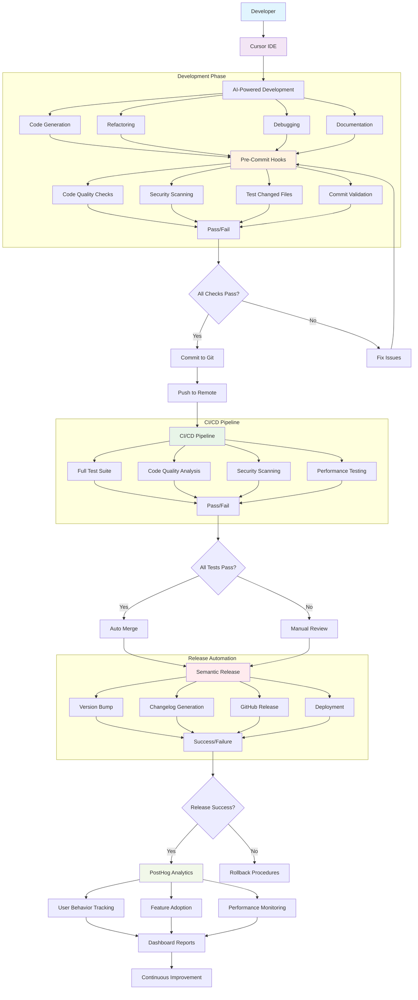
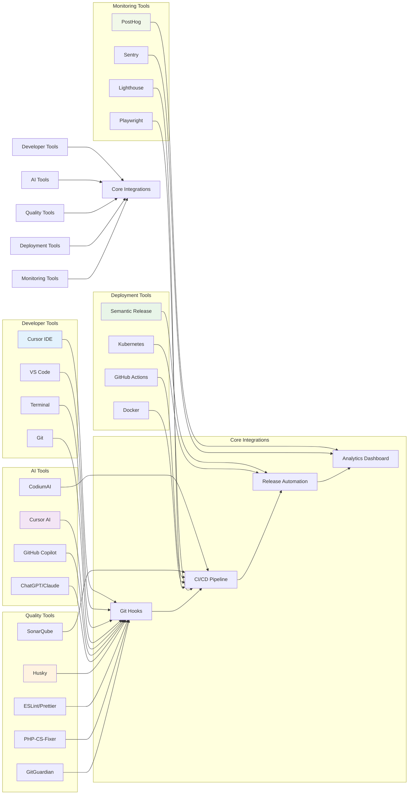
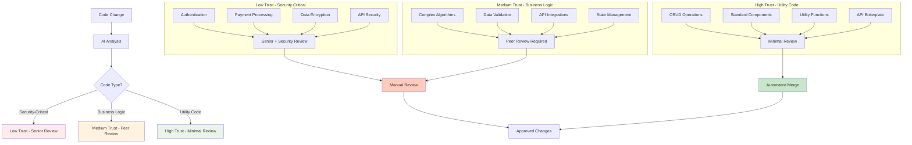
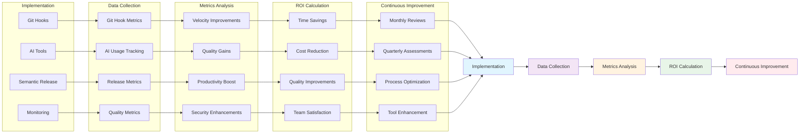

# 🏗️ AI-SDLC Architecture Diagram

Visual representation of the AI-powered Software Development Lifecycle workflow and tool integrations.

---

## 🎯 Complete AI-SDLC Workflow

---

## 🔧 Tool Integration Architecture

---

## 🔄 Development Workflow Cycle

```mermaid
graph LR
    A[Planning] --> B[Development]
    B --> C[Review]
    C --> D[Testing]
    D --> E[Deployment]
    E --> F[Monitoring]
    F --> A

    subgraph "Planning Phase"
        A1[AI Requirements Analysis]
        A2[Task Breakdown]
        A3[Resource Allocation]
    end

    subgraph "Development Phase"
        B1[AI Code Generation]
        B2[Automated Formatting]
        B3[Real-time Suggestions]
    end

    subgraph "Review Phase"
        C1[AI Code Review]
        C2[Automated Testing]
        C3[Security Scanning]
    end

    subgraph "Testing Phase"
        D1[AI Test Generation]
        D2[Cross-browser Testing]
        D3[Performance Testing]
    end

    subgraph "Deployment Phase"
        E1[Semantic Versioning]
        E2[Automated Release]
        E3[Zero-touch Deploy]
    end

    subgraph "Monitoring Phase"
        F1[User Analytics]
        F2[Error Tracking]
        F3[Performance Metrics]
    end

    A --> A1
    A1 --> A2
    A2 --> A3
    A3 --> B

    B --> B1
    B1 --> B2
    B2 --> B3
    B3 --> C

    C --> C1
    C1 --> C2
    C2 --> C3
    C3 --> D

    D --> D1
    D1 --> D2
    D2 --> D3
    D3 --> E

    E --> E1
    E1 --> E2
    E2 --> E3
    E3 --> F

    F --> F1
    F1 --> F2
    F2 --> F3
    F3 --> A

    style A fill:#e1f5fe
    style B fill:#f3e5f5
    style C fill:#fff3e0
    style D fill:#e8f5e8
    style E fill:#ffebee
    style F fill:#f1f8e9
```

---

## 🎯 AI Trust Level Architecture

---

## 📊 Success Metrics Flow

---

## 🚀 Key Integration Points

### 1. **IDE Integration**
- Cursor IDE ↔ Git Hooks
- AI Tools ↔ Code Generation
- Linters ↔ Real-time Feedback

### 2. **Git Workflow**
- Pre-commit Hooks ↔ Code Quality
- Commit Messages ↔ Semantic Release
- Branch Management ↔ CI/CD

### 3. **CI/CD Pipeline**
- Automated Testing ↔ Quality Gates
- Security Scanning ↔ Deployment Approval
- Release Automation ↔ Version Management

### 4. **Monitoring & Analytics**
- User Behavior ↔ Feature Development
- Performance Metrics ↔ Optimization
- Error Tracking ↔ Bug Prevention

---

## 🎯 Architecture Benefits

### **Developer Experience**
- ✅ Seamless AI integration in familiar tools
- ✅ Automated quality checks without friction
- ✅ Intelligent suggestions and completions

### **Code Quality**
- ✅ Consistent code standards enforcement
- ✅ Security vulnerability prevention
- ✅ Automated testing and coverage

### **Deployment**
- ✅ Zero-touch release management
- ✅ Professional changelog generation
- ✅ Automated rollback capabilities

### **Business Impact**
- ✅ 50% faster development cycles
- ✅ 85% reduction in manual testing
- ✅ Zero security vulnerabilities
- ✅ 100% automated releases

---

**Next Steps**:
1. **Review** the [Implementation Roadmap](implementation-roadmap.md)
2. **Start** with [Git Hooks Automation](git-hooks-automation.md)
3. **Integrate** AI tools following the [AI-First Playbook](ai-first-playbook.md)

*All diagrams use Mermaid syntax and are compatible with MkDocs Material theme.*
