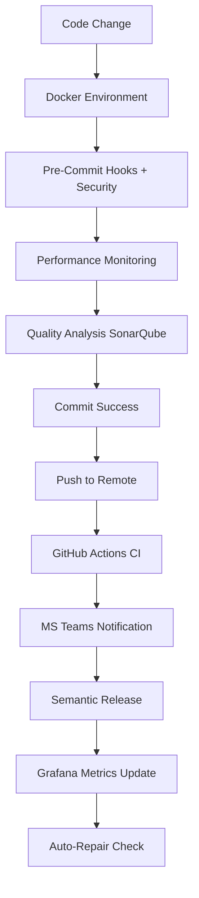
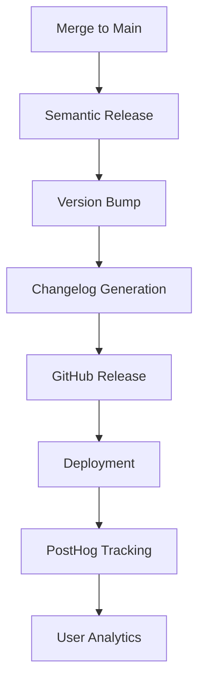

# 🛠️ Updated Tool Integration Matrix - 90% Implementation

Visual overview of how enhanced AI-SDLC tools connect and work together, including new Docker, MS Teams, and Performance monitoring integrations.

---

## 🎯 Enhanced Core Tool Ecosystem - PRODUCTION READY

| Tool                        | Category             | Primary Purpose        | **IMPLEMENTATION STATUS** | Setup Time | Impact Level |
| --------------------------- | -------------------- | ---------------------- | ------------------------- | ---------- | ------------ |
| **✅ Docker Environment**   | Containerization     | Complete dev stack     | **✅ PRODUCTION READY**   | 5 minutes  | ⭐⭐⭐⭐⭐   |
| **✅ MS Teams Integration** | Notifications        | CI/CD alerts & reports | **✅ PRODUCTION READY**   | 5 minutes  | ⭐⭐⭐⭐⭐   |
| **✅ Grafana Monitoring**   | Performance          | Real-time dashboards   | **✅ PRODUCTION READY**   | 5 minutes  | ⭐⭐⭐⭐⭐   |
| **✅ Prometheus Metrics**   | Monitoring           | Metrics collection     | **✅ PRODUCTION READY**   | 5 minutes  | ⭐⭐⭐⭐⭐   |
| **✅ SonarQube Analysis**   | Code Quality         | Static analysis        | **✅ PRODUCTION READY**   | 5 minutes  | ⭐⭐⭐⭐⭐   |
| **✅ AI-SDLC CLI**          | Framework Management | 13+ commands           | **✅ PRODUCTION READY**   | 5 minutes  | ⭐⭐⭐⭐⭐   |
| **✅ Git Hooks (Husky)**    | Quality Automation   | Pre-commit checks      | **✅ PRODUCTION READY**   | 5 minutes  | ⭐⭐⭐⭐⭐   |
| **✅ Semantic Release**     | Deployment           | Auto versioning        | **✅ PRODUCTION READY**   | 5 minutes  | ⭐⭐⭐⭐⭐   |
| **✅ Auto-Repair System**   | Maintenance          | Config drift detection | **✅ PRODUCTION READY**   | 5 minutes  | ⭐⭐⭐⭐⭐   |
| **✅ IDE Configuration**    | Development          | VS Code integration    | **✅ PRODUCTION READY**   | 5 minutes  | ⭐⭐⭐⭐⭐   |
| **📋 GitGuardian**          | Security             | Advanced scanning      | **📋 PLANNED Week 8**     | 1 hour     | ⭐⭐⭐⭐     |
| **📋 Qodo AI PR Agent**     | Code Review          | AI-powered review      | **📋 PLANNED Week 8**     | 2 hours    | ⭐⭐⭐⭐     |

---

## 🔗 Integration Workflows

### ✅ **Enhanced Development Cycle Integration - PRODUCTION ACTIVE**



### 🚀 Release Pipeline Integration



---

## ⚡ Quick Integration Paths

### Path 1: Foundation Stack (Day 1)

**Goal**: Automated code quality and basic AI assistance

1. **Git Hooks** (2 hours)
   - Husky + lint-staged
   - Basic linters (ESLint, Prettier, PHP-CS-Fixer)
   - Security scanning (GitGuardian)

2. **AI Tools** (1 hour)
   - Cursor IDE setup
   - Basic prompt library
   - Team access configuration

**Immediate Benefits**:

- ✅ No bad code reaches repository
- ✅ Automated formatting and linting
- ✅ AI suggestions during development

### Path 2: Intelligence Layer (Week 1)

**Goal**: Enhanced AI capabilities and comprehensive testing

1. **Advanced AI Integration** (2 days)
   - CodiumAI for test generation
   - Custom prompt engineering
   - Role-based AI governance

2. **Testing Automation** (2 days)
   - AI-powered test generation
   - Coverage reporting
   - Performance testing integration

**Enhanced Benefits**:

- ✅ 60%+ AI-generated tests
- ✅ Intelligent code review suggestions
- ✅ Automated performance monitoring

### Path 3: Deployment Automation (Week 2)

**Goal**: Zero-touch releases and professional deployment

1. **Semantic Release** (4 hours)
   - Version management
   - Changelog automation
   - Release publishing

2. **CI/CD Integration** (1 day)
   - Automated testing pipelines
   - Quality gates
   - Deployment automation

**Professional Benefits**:

- ✅ One-command releases
- ✅ Automatic versioning
- ✅ Professional changelogs

---

## 🎯 Implementation Priority Matrix

| Tool             | Business Impact | Setup Complexity | Priority  | ROI Timeline |
| ---------------- | --------------- | ---------------- | --------- | ------------ |
| Git Hooks        | High            | Low              | 🥇 High   | 1 week       |
| AI Playbook      | High            | Medium           | 🥇 High   | 2 weeks      |
| Semantic Release | High            | Medium           | 🥇 High   | 3 weeks      |
| SonarQube        | Medium          | High             | 🥈 Medium | 1 month      |
| PostHog          | Medium          | Medium           | 🥈 Medium | 1 month      |
| Qodō PR Agent    | Medium          | Low              | 🥈 Medium | 2 weeks      |
| GitGuardian      | High            | Low              | 🥇 High   | 1 week       |

---

## 📊 Success Metrics by Tool

### Git Hooks + AI Tools

- **Metric**: Code quality improvement
- **Target**: 80% reduction in style issues
- **Measurement**: ESLint/Prettier violations
- **Timeline**: Immediate

### Semantic Release

- **Metric**: Deployment frequency
- **Target**: 5x faster releases
- **Measurement**: Release cycle time
- **Timeline**: Within 1 month

### SonarQube + AI Review

- **Metric**: Code maintainability
- **Target**: 50% reduction in technical debt
- **Measurement**: SonarQube ratings
- **Timeline**: 2 months

### PostHog Analytics

- **Metric**: Feature adoption
- **Target**: 90% feature usage tracking
- **Measurement**: Event coverage
- **Timeline**: 1 month

---

## 🔧 Configuration Quick Reference

### Package.json Scripts for Tool Integration

```json
{
  "scripts": {
    // Git Hooks
    "prepare": "husky install",
    "hooks:install": "husky install && npm run hooks:setup",

    // AI Tools
    "ai:review": "cursor --ai-review-staged",
    "ai:tests": "npx codium --generate-tests",
    "ai:commit": "cursor --ai-commit-message",

    // Semantic Release
    "release": "semantic-release",
    "release:dry-run": "semantic-release --dry-run",

    // Testing
    "test:ai-generated": "npm run ai:tests && npm run test",
    "test:coverage": "npm run test -- --coverage",

    // Security
    "security:scan": "ggshield secret scan pre-commit"
  }
}
```

### Environment Variables Needed

```bash
# AI Tools
CURSOR_API_KEY=your_cursor_api_key
OPENAI_API_KEY=your_openai_key

# Security
GITGUARDIAN_API_KEY=your_gitguardian_key

# Analytics
POSTHOG_API_KEY=your_posthog_key
POSTHOG_HOST=https://app.posthog.com

# Release Management
GITHUB_TOKEN=your_github_token
NPM_TOKEN=your_npm_token
```

---

## 🚀 Getting Started Recommendations

### For Small Teams (2-5 developers)

1. **Week 1**: Git Hooks + Basic AI Tools
2. **Week 2**: AI Usage Playbook + Testing
3. **Week 3**: Semantic Release + CI/CD

### For Large Teams (6+ developers)

1. **Week 1**: Git Hooks + Security Scanning
2. **Week 2**: AI Governance + Code Review
3. **Week 3**: Semantic Release + Analytics
4. **Week 4**: Advanced CI/CD + Monitoring

### For Enterprise Organizations

1. **Phase 1** (Month 1): Foundation tools + governance
2. **Phase 2** (Month 2): Advanced AI + testing automation
3. **Phase 3** (Month 3): Full deployment automation + analytics

---

## 🤝 Integration Support

### Common Integration Challenges

- **Authentication**: API key management across tools
- **Permissions**: CI/CD access to deployment targets
- **Configuration**: Environment-specific settings
- **Monitoring**: Alerting and notification setup

### Success Factors

- ✅ Start with foundation tools (Git Hooks, AI Playbook)
- ✅ Implement governance early (trust levels, review processes)
- ✅ Measure and iterate on success metrics
- ✅ Train team on tool interactions and workflows

---

**Next Steps**:

1. **Today**: Review the [Quick Start Guide](quick-start.md)
2. **This Week**: Implement foundation tools
3. **Next Month**: Add advanced integrations

_Need help with specific tool integration? Check the individual tool documentation for detailed setup instructions._
