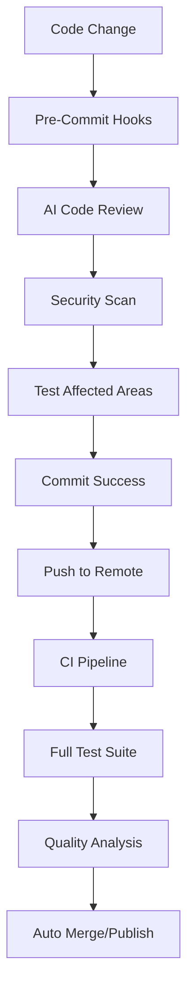

# 🛠️ Tool Integration Matrix

Visual overview of how AI-SDLC tools connect and work together to create a seamless development workflow.

---

## 🎯 Core Tool Ecosystem

| Tool | Category | Primary Purpose | Integration Points | Setup Time | Impact Level |
|------|----------|----------------|-------------------|------------|--------------|
| **Cursor IDE** | AI Development | Code generation & refactoring | All files, Git, Terminal | 30 min | ⭐⭐⭐⭐⭐ |
| **Husky** | Git Hooks | Pre-commit automation | Git, Linters, Tests | 2 hours | ⭐⭐⭐⭐⭐ |
| **Semantic Release** | Deployment | Version management & releases | Git, CI/CD, Package managers | 4 hours | ⭐⭐⭐⭐⭐ |
| **GitGuardian** | Security | Secrets detection | Git hooks, CI/CD | 1 hour | ⭐⭐⭐⭐ |
| **SonarQube** | Code Quality | Static analysis & AI review | CI/CD, IDE | 1 day | ⭐⭐⭐⭐ |
| **PostHog** | Analytics | User behavior tracking | Frontend, Backend | 3 hours | ⭐⭐⭐ |
| **Qodō AI PR Agent** | Code Review | Automated PR review | GitHub, GitLab | 2 hours | ⭐⭐⭐⭐ |

---

## 🔗 Integration Workflows

### 🔄 Development Cycle Integration


### 🚀 Release Pipeline Integration


---

## ⚡ Quick Integration Paths

### Path 1: Foundation Stack (Day 1)
**Goal**: Automated code quality and basic AI assistance

1. **Git Hooks** (2 hours)
   - Husky + lint-staged
   - Basic linters (ESLint, Prettier, PHP-CS-Fixer)
   - Security scanning (GitGuardian)

2. **AI Tools** (1 hour)
   - Cursor IDE setup
   - Basic prompt library
   - Team access configuration

**Immediate Benefits**:
- ✅ No bad code reaches repository
- ✅ Automated formatting and linting
- ✅ AI suggestions during development

### Path 2: Intelligence Layer (Week 1)
**Goal**: Enhanced AI capabilities and comprehensive testing

1. **Advanced AI Integration** (2 days)
   - CodiumAI for test generation
   - Custom prompt engineering
   - Role-based AI governance

2. **Testing Automation** (2 days)
   - AI-powered test generation
   - Coverage reporting
   - Performance testing integration

**Enhanced Benefits**:
- ✅ 60%+ AI-generated tests
- ✅ Intelligent code review suggestions
- ✅ Automated performance monitoring

### Path 3: Deployment Automation (Week 2)
**Goal**: Zero-touch releases and professional deployment

1. **Semantic Release** (4 hours)
   - Version management
   - Changelog automation
   - Release publishing

2. **CI/CD Integration** (1 day)
   - Automated testing pipelines
   - Quality gates
   - Deployment automation

**Professional Benefits**:
- ✅ One-command releases
- ✅ Automatic versioning
- ✅ Professional changelogs

---

## 🎯 Implementation Priority Matrix

| Tool | Business Impact | Setup Complexity | Priority | ROI Timeline |
|------|----------------|------------------|----------|--------------|
| Git Hooks | High | Low | 🥇 High | 1 week |
| AI Playbook | High | Medium | 🥇 High | 2 weeks |
| Semantic Release | High | Medium | 🥇 High | 3 weeks |
| SonarQube | Medium | High | 🥈 Medium | 1 month |
| PostHog | Medium | Medium | 🥈 Medium | 1 month |
| Qodō PR Agent | Medium | Low | 🥈 Medium | 2 weeks |
| GitGuardian | High | Low | 🥇 High | 1 week |

---

## 📊 Success Metrics by Tool

### Git Hooks + AI Tools
- **Metric**: Code quality improvement
- **Target**: 80% reduction in style issues
- **Measurement**: ESLint/Prettier violations
- **Timeline**: Immediate

### Semantic Release
- **Metric**: Deployment frequency
- **Target**: 5x faster releases
- **Measurement**: Release cycle time
- **Timeline**: Within 1 month

### SonarQube + AI Review
- **Metric**: Code maintainability
- **Target**: 50% reduction in technical debt
- **Measurement**: SonarQube ratings
- **Timeline**: 2 months

### PostHog Analytics
- **Metric**: Feature adoption
- **Target**: 90% feature usage tracking
- **Measurement**: Event coverage
- **Timeline**: 1 month

---

## 🔧 Configuration Quick Reference

### Package.json Scripts for Tool Integration
```json
{
  "scripts": {
    // Git Hooks
    "prepare": "husky install",
    "hooks:install": "husky install && npm run hooks:setup",

    // AI Tools
    "ai:review": "cursor --ai-review-staged",
    "ai:tests": "npx codium --generate-tests",
    "ai:commit": "cursor --ai-commit-message",

    // Semantic Release
    "release": "semantic-release",
    "release:dry-run": "semantic-release --dry-run",

    // Testing
    "test:ai-generated": "npm run ai:tests && npm run test",
    "test:coverage": "npm run test -- --coverage",

    // Security
    "security:scan": "ggshield secret scan pre-commit"
  }
}
```

### Environment Variables Needed
```bash
# AI Tools
CURSOR_API_KEY=your_cursor_api_key
OPENAI_API_KEY=your_openai_key

# Security
GITGUARDIAN_API_KEY=your_gitguardian_key

# Analytics
POSTHOG_API_KEY=your_posthog_key
POSTHOG_HOST=https://app.posthog.com

# Release Management
GITHUB_TOKEN=your_github_token
NPM_TOKEN=your_npm_token
```

---

## 🚀 Getting Started Recommendations

### For Small Teams (2-5 developers)
1. **Week 1**: Git Hooks + Basic AI Tools
2. **Week 2**: AI Usage Playbook + Testing
3. **Week 3**: Semantic Release + CI/CD

### For Large Teams (6+ developers)
1. **Week 1**: Git Hooks + Security Scanning
2. **Week 2**: AI Governance + Code Review
3. **Week 3**: Semantic Release + Analytics
4. **Week 4**: Advanced CI/CD + Monitoring

### For Enterprise Organizations
1. **Phase 1** (Month 1): Foundation tools + governance
2. **Phase 2** (Month 2): Advanced AI + testing automation
3. **Phase 3** (Month 3): Full deployment automation + analytics

---

## 🤝 Integration Support

### Common Integration Challenges
- **Authentication**: API key management across tools
- **Permissions**: CI/CD access to deployment targets
- **Configuration**: Environment-specific settings
- **Monitoring**: Alerting and notification setup

### Success Factors
- ✅ Start with foundation tools (Git Hooks, AI Playbook)
- ✅ Implement governance early (trust levels, review processes)
- ✅ Measure and iterate on success metrics
- ✅ Train team on tool interactions and workflows

---

**Next Steps**:
1. **Today**: Review the [Quick Start Guide](quick-start.md)
2. **This Week**: Implement foundation tools
3. **Next Month**: Add advanced integrations

*Need help with specific tool integration? Check the individual tool documentation for detailed setup instructions.*
