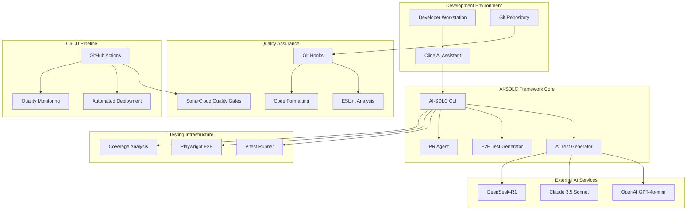
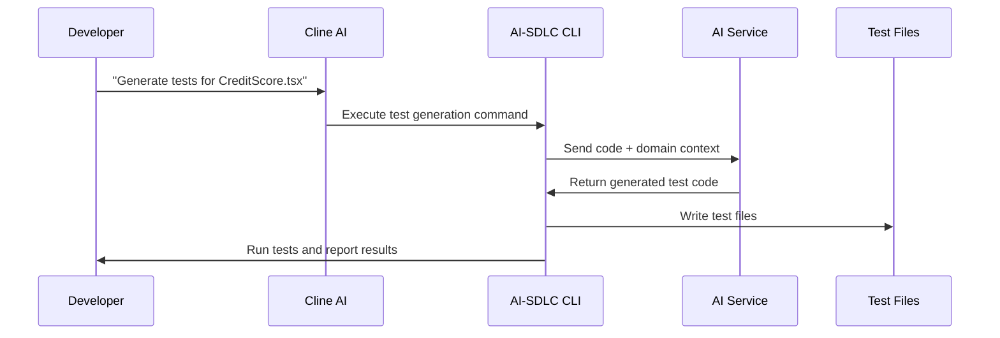
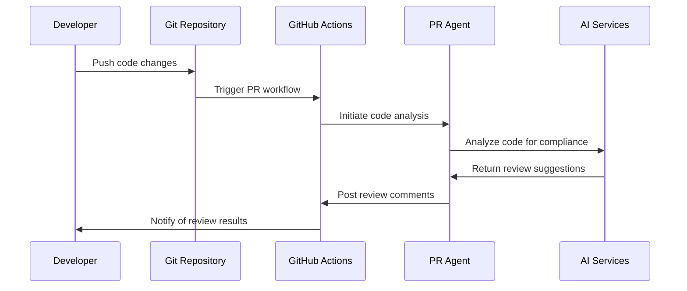
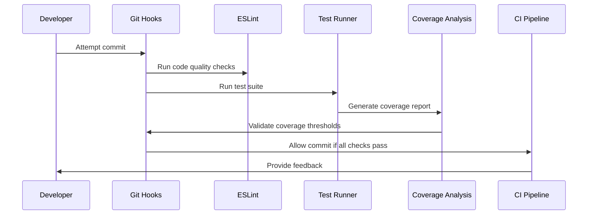

# System Architecture - The Credit Pros AI-SDLC Framework

## High-Level Architecture



## Component Architecture

### 1. AI-SDLC CLI Core

Central command-line interface that orchestrates all automation:

```typescript
interface AISDLCCore {
  commands: {
    setup: () => void;
    status: () => SystemStatus;
    testGen: (target: string) => TestGenerationResult;
    testGenE2E: (target: string) => E2ETestResult;
    validate: () => ValidationReport;
    doctor: () => DiagnosticReport;
  };

  config: {
    framework: string;
    testing: TestingConfig;
    ai: AIConfig;
    compliance: ComplianceConfig;
  };
}
```

### 2. Multi-Model AI Strategy

Cost-optimized AI model routing based on task complexity:

```typescript
interface AIModelRouter {
  selectModel(task: TaskType, complexity: ComplexityLevel): AIModel;

  models: {
    primary: 'gpt-4o-mini'; // 80% of tasks, cost-optimized
    complex: 'claude-3.5-sonnet'; // Complex analysis, higher accuracy
    planning: 'deepseek-r1'; // Planning tasks, 97% cost reduction
    fallback: 'template-based'; // Offline/API failure scenarios
  };

  costOptimization: {
    smartCaching: boolean;
    contextCompression: boolean;
    batchProcessing: boolean;
  };
}
```

### 3. Testing Framework Integration

Comprehensive testing strategy with multiple frameworks:

```typescript
interface TestingFramework {
  unitTesting: {
    framework: 'vitest';
    coverage: {
      lines: 80;
      functions: 80;
      branches: 70;
    };
    features: ['mocking', 'snapshots', 'watch-mode'];
  };

  integrationTesting: {
    apiTesting: 'vitest + msw';
    databaseTesting: 'laravel-pest + refresh-database';
    authTesting: 'sanctum-testing';
  };

  e2eTesting: {
    framework: 'playwright';
    browsers: ['chromium', 'firefox', 'webkit'];
    features: ['auto-healing', 'visual-regression', 'parallel-execution'];
  };
}
```

## Data Flow Architecture

### 1. Test Generation Flow



### 2. Code Review Flow



### 3. Quality Assurance Flow



## Security Architecture

### 1. PII Data Protection

```typescript
interface SecurityLayer {
  encryption: {
    atRest: 'AES-256';
    inTransit: 'TLS 1.3';
    keyManagement: 'AWS KMS' | 'HashiCorp Vault';
  };

  dataHandling: {
    piiMasking: (data: string) => string;
    auditLogging: (action: string, data: any) => void;
    accessControl: 'role-based' | 'attribute-based';
  };

  compliance: {
    fcraValidation: boolean;
    factaCompliance: boolean;
    stateRegulations: string[];
  };
}
```

### 2. API Security

```typescript
interface APISecurityConfig {
  authentication: {
    method: 'JWT' | 'OAuth2' | 'API-Key';
    tokenExpiration: number;
    refreshTokenRotation: boolean;
  };

  authorization: {
    permissiblePurposeValidation: boolean;
    roleBasedAccess: boolean;
    resourceLevelPermissions: boolean;
  };

  rateLimiting: {
    requestsPerMinute: number;
    burstLimit: number;
    blockDuration: number;
  };

  monitoring: {
    suspiciousActivityDetection: boolean;
    redFlagsMonitoring: boolean;
    anomalyDetection: boolean;
  };
}
```

## Integration Points

### 1. Credit Bureau APIs

```typescript
interface CreditBureauIntegration {
  providers: ['Experian', 'Equifax', 'TransUnion'];

  configuration: {
    timeout: 30000; // 30 seconds
    retryAttempts: 3;
    rateLimiting: 'provider-specific';
    fallbackBehavior: 'graceful-degradation';
  };

  dataFlow: {
    request: CreditReportRequest;
    response: CreditReportResponse;
    errorHandling: 'comprehensive';
    auditTrail: 'mandatory';
  };
}
```

### 2. External AI Services Integration

```typescript
interface ExternalAIIntegration {
  openai: {
    endpoint: 'https://api.openai.com/v1';
    model: 'gpt-4o-mini';
    maxTokens: 4000;
    temperature: 0.1; // Consistent results for code generation
  };

  claude: {
    endpoint: 'https://api.anthropic.com/v1';
    model: 'claude-3-5-sonnet-20241022';
    maxTokens: 8000;
    temperature: 0.2;
  };

  deepseek: {
    endpoint: 'https://api.deepseek.com/v1';
    model: 'deepseek-r1';
    maxTokens: 2000;
    temperature: 0.3;
  };

  costOptimization: {
    caching: 'redis-based';
    batchProcessing: true;
    smartRouting: true;
  };
}
```

## Deployment Architecture

### 1. Development Environment

```yaml
development:
  database: postgresql-local
  cache: redis-local
  ai_services: api-based
  testing: full-suite
  monitoring: basic

  features:
    hot_reload: true
    debug_mode: true
    test_coverage: enforced
    git_hooks: enabled
```

### 2. Staging Environment

```yaml
staging:
  database: postgresql-managed
  cache: redis-managed
  ai_services: production-mirrors
  testing: automated + manual
  monitoring: comprehensive

  features:
    performance_testing: enabled
    security_scanning: automated
    compliance_validation: enforced
    load_testing: periodic
```

### 3. Production Environment

```yaml
production:
  database: postgresql-cluster
  cache: redis-cluster
  ai_services: production-optimized
  testing: automated-only
  monitoring: real-time + alerting

  features:
    auto_scaling: enabled
    disaster_recovery: multi-region
    security_hardening: maximum
    compliance_auditing: continuous
```

## Monitoring and Observability

### 1. Application Monitoring

```typescript
interface MonitoringStack {
  metrics: {
    performance: 'response_times, throughput, error_rates';
    business: 'credit_reports_processed, disputes_resolved';
    ai: 'model_usage, cost_tracking, accuracy_metrics';
  };

  logging: {
    application: 'structured_json_logs';
    security: 'audit_trail_logs';
    compliance: 'fcra_violation_logs';
  };

  alerting: {
    performance_degradation: true;
    security_incidents: true;
    compliance_violations: true;
    ai_cost_overruns: true;
  };
}
```

### 2. Quality Metrics

```typescript
interface QualityMetrics {
  codeQuality: {
    testCoverage: 'minimum_80_percent';
    eslintCompliance: 'zero_errors';
    typeScriptStrict: 'enabled';
    sonarCloudGates: 'passing';
  };

  aiEffectiveness: {
    testGenerationAccuracy: 'percentage_passing';
    costOptimization: 'savings_vs_baseline';
    developerVelocity: 'features_per_sprint';
    bugDetectionRate: 'automated_vs_manual';
  };

  compliance: {
    fcraViolations: 'zero_tolerance';
    auditTrailCompleteness: '100_percent';
    dataEncryptionCoverage: 'all_pii';
    regulatoryReporting: 'automated';
  };
}
```

This architecture ensures scalability, security, compliance, and cost-effectiveness while providing comprehensive development automation for The Credit Pros credit repair platform.
